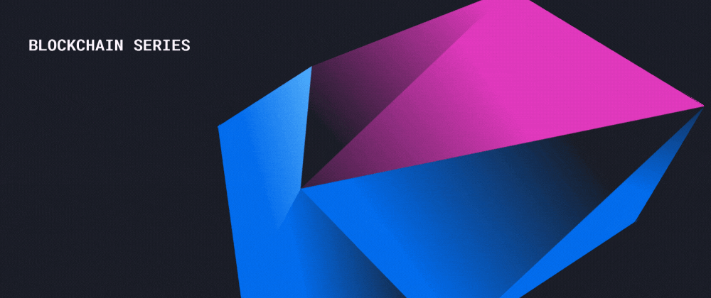

  # What's the Blockchain

  
  
  📌 The simplest answer is that the Blockchain is a secure, transparent and decentralized ledger.

  📌  “Secure” doesn’t mean that it tries to hide information. It simply means that nobody’s going to tamper with records on the Blockchain without sending up red flags that would be very quickly noticed by alert Blockchain developers. Even if somebody does attempt to fraudulently alter records, the original records will still exist on the valid Blockchain and can be pinned down by comparing information on duplicate records.

📌Maintaining the Blockchain relies on the operation of multiple nodes that are capable of storing transaction data and the operation of processors that can validate new data.

📌Think of the nodes as completely equal servers that regularly update one another with data and make it possible for authenticated clients to connect to them, if you like. The multiple, regularly updated nodes builds in a considerable amount of redundancy into the system. If a node malfunctions, the IT staff can work with a Blockchain expert to isolate the server and troubleshoot that node to determine what went wrong.

📌The Blockchain was originally designed to be a decentralized system that keeps track of debits and credits. The existence of thousands of Bitcoin nodes on six continents demonstrates the Blockchains capacity to become effectively the “World Wide Web” of finance.