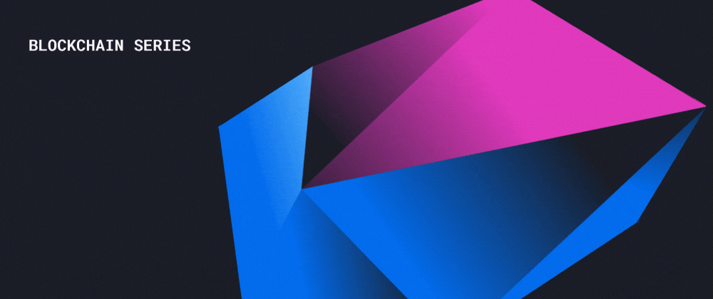

### So a lot of people talk about some complex terms like nodes , Double Spending , Proof of Work , HashCash and much more so in this post I will try to explain these terms in simple Language

 

----

 

# 📌 Blockchain - 

>The blockchain is an immutable (unchangeable, meaning a transaction or file recorded cannot be changed) distributed digital ledger (digital record of transactions or data stored in multiple places on a computer network) with many use cases beyond cryptocurrencies.

>Immutable and distributed are two fundamental blockchain properties. The immutability of the ledger means you can always trust it to be accurate. Being distributed protects the blockchain from network attacks.

## Types of Blockchains

- ✏️ **Public Blockchains** - Public blockchains are open, decentralized networks of computers accessible to anyone wanting to request or validate a transaction (check for accuracy). Those (miners) who validate transactions receive rewards.

- ✏️ **Private Blockchains** - Private blockchains are not open, they have access restrictions. People who want to join require permission from the system administrator. They are typically governed by one entity, meaning they’re centralized. For example, Hyperledger is a private, permissioned blockchain.

- ✏️ **Hybrid Blockchains or Consortiums** - Consortiums are a combination of public and private blockchains and contain centralized and decentralized features. For example, Energy Web Foundation, Dragonchain, and R3.

- ✏️ **Sidechains** - A sidechain is a blockchain running parallel to the main chain. It allows users to move digital assets between two different blockchains and improves scalability and efficiency. An example of a sidechain is the Liquid Network.

 

----

 

# 📌 Bitcoin
> Bitcoin, invented in 2008, is the world’s first decentralized cryptocurrency. It is decentralized because control is shared by all the computers on the network; it is a cryptocurrency because it is a subset of ‘digital currency’ (no physical currency) that uses cryptography as a method to verify transactions and regulate the generation of further units.

 

----

 

# 📌Block 
> In Bitcoin, Transactions are combined into single blocks and every 10 minutes, a new block of about 1MB is size is created. 

> Every block in a blockchain contains 4 components: a timestamp, a reference to the previous block, a summary of the included transaction and the Proof of Work that went into creating the secure block.

 

----

 

# 📌 Mining
> Mining means adding transaction records to the blockchain ledger after confirming the validity of the transactions. It involves using complex hardware to perform mathematical calculations in order to verify transactions.

 

----

 

# 📌 Proof of Work (POW)
> A Proof of Work is a requirement that expensive computations be performed in order to facilitate transactions. POW exists to enable trustless consensus. A hashed block is considered as a POW.

 

----

 

# 📌Hashcash
> Hashcash is an example of a POW. Bitcoin uses the hashcash POW function.

>Hashcash is a POW algorithm that results in data that is difficult to produce in terms of computational work but is easy for others to verify.

 

----

 

# 📌 Double Spending
> Sending a bitcoin transaction to two different recipients at the same time is called double spending. This must be avoided at all costs.

 

----

 

# 📌 Nodes
> Nodes are distributed computers in the network that all have a copy of the entire blockchain. As new users enter the blockchain network, copies of the blockchain and the access to it is distributed. 

> The data is replicable, synchronized and shared across all the nodes in the across multiple networks. The data is not controlled by a singular node or network.

 

----

 

# 📌 Address
> A bitcoin address is a long string of alphanumeric characters used to send, receive or hold currency. To confirm a transaction, a bitcoin wallet holder needs two encrypted keys- a wallet address and a private key.

 

----

 

# 📌 Smart Contract
> A smart contract is a digital agreement stored on the blockchain that is unalterable, once signed. It defines certain logic operations that have to be fulfilled in order to perform tasks such as deposit money or data.

 

----
----

 

Hit me up on discord if you have any Questions or need any Help

